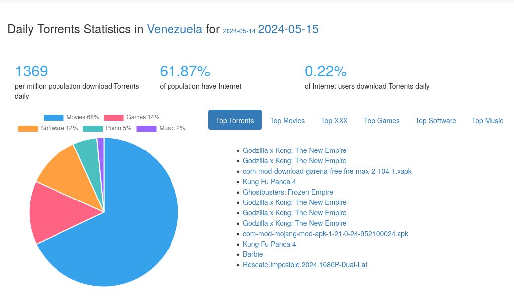
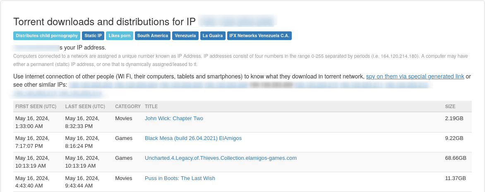

# Situation
Venezuela has a bandwidth problem, and plenty of people will stretch whatever connection is available—especially the internet at work.

What happens when you let tech-savvy people stay online for eight hours a day? I call it **The Intern is downloading movies** problem.

# Solution 
I Know What You Download is a monitoring tool that allows you to check if someone is downloading torrents. Here’s how to use it:
1. Visit [iknowwhatyoudownload.com](https://iknowwhatyoudownload.com/en/peer/).
2. On the homepage, you’ll see your current external IP address.
3. For an organization-wide check, review the results page to see whether any torrents are being downloaded from that IP (you can test other addresses if you’re unsure).

## For tracking other people
You can [create a link](https://iknowwhatyoudownload.com/en/link/) and send it; the tracker logs activity as soon as someone clicks.

## For tracking peers
If you have the `.torrent` file you can extract peers and seeds from your torrent client (e.g., qBittorrent).
1. Copy the selected peer or host (or everything if you have time).
2. Convert the host address using an IP lookup tool like [ip-tracker.org](https://www.ip-tracker.org/) or [whois.domaintools.com](https://whois.domaintools.com/) if it’s not listed.
3. Use [iphub.info](https://iphub.info/) to determine whether the IP is a proxy or a residential address.

Note that VPNs and proxies may give noisy results, as explained in the [FAQ](https://iknowwhatyoudownload.com/en/contacts/). Still, it’s rare to see premium torrent VPNs inside organizations in Venezuela because perimeter firewalls like Fortinet often block that traffic.

# References
Photo by <a href="https://unsplash.com/@jsshotz?utm_content=creditCopyText&utm_medium=referral&utm_source=unsplash">Jorge Salvador</a> on <a href="https://unsplash.com/photos/black-and-white-satellite-dish-wjMMVxy8C0g?utm_content=creditCopyText&utm_medium=referral&utm_source=unsplash">Unsplash</a>

[Torrent Freak](https://torrentfreak.com/i-know-what-you-download-overwhelmed-by-bogus-dmca-notices-221023/)