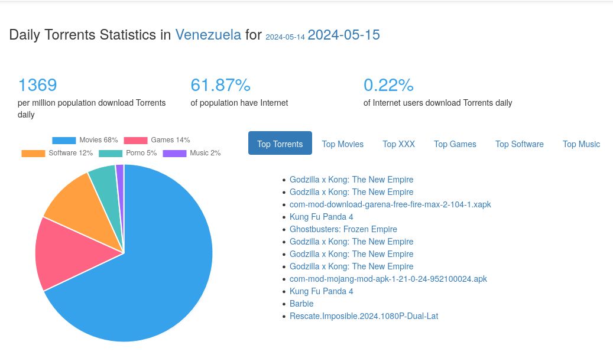

# Situation
Venezuela has a bandwidth problem, and by the nature of our culture, most people will try to take advantage of anything, especially internet.

What happens when you let tech savvy people with access to internet for 8hrs a day? I call it **The Intern is downloading movies** problem.

# Solution 

I Know What You Download is a monitoring tool that allows you to check if someone is downloading torrents. Here’s how to use it:
1. Visit [iknowwhatyoudownload.com](https://iknowwhatyoudownload.com/en/peer/).
2. On the homepage, you’ll see your current external IP address.
3. To investigate from an organization point of view.

## For tracking other people

You can [create a link](https://iknowwhatyoudownload.com/en/link/) and sent it via email 

## Or 
You can extract the peers and seeds from your torrent client (e.g., qBitTorrent). 
1. Copy selected peer or host (or all if you have time).
2. Convert the host address using an IP lookup tool like [ip-tracker.org](https://www.ip-tracker.org/)) or [whois.domaintools.com](https://whois.domaintools.com/) if it’s not listed.
3. Use [iphub.info](https://iphub.info/) to determine whether the IP is a proxy or a residential one.

Note that VPN and proxy country origins may not be accurate, but VPNs for torrent are usually paid. Further investigation maybe be necessary.

# References
Photo by <a href="https://unsplash.com/@jsshotz?utm_content=creditCopyText&utm_medium=referral&utm_source=unsplash">Jorge Salvador</a> on <a href="https://unsplash.com/photos/black-and-white-satellite-dish-wjMMVxy8C0g?utm_content=creditCopyText&utm_medium=referral&utm_source=unsplash">Unsplash</a>

[Torrent Freak](https://torrentfreak.com/i-know-what-you-download-overwhelmed-by-bogus-dmca-notices-221023/)