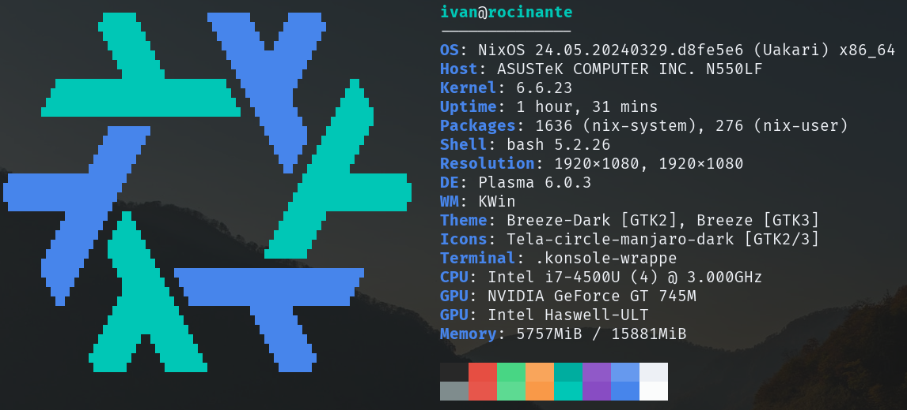

# Hardware
## ASUS N550LF (Laptop)

- NixOS 24.05 (Uakari) -> [Dotfiles](https://github.com/ivanovertime/.dotfiles)
- KDE Plasma 6
- CPU: Intel i7-4500U (4) @ 3.000GHz
- GPU: NVIDIA GeForce GT 745M
- Memory: 16GB
## HP Prodesk (Homelab)
- Proxmox VE 8.0
  - Ubuntu Server as a Control Plane for VPS where I host.
  - Windows Server 2019 for things that requiere a windows machine.
- CPU: Intel i5-4570 (4) @ 3.20GHz (1 Socket)
- Memory: 32GB
# Software
## Development
- VSCode
- Obsidian
- Github
## Hosting 
- Coolify
- Portainer
## CI/CD
- Netlify
- Github Actions